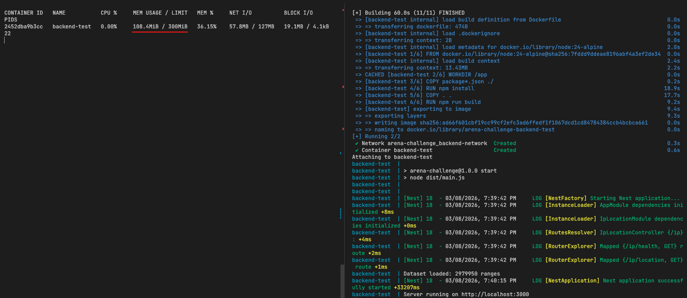
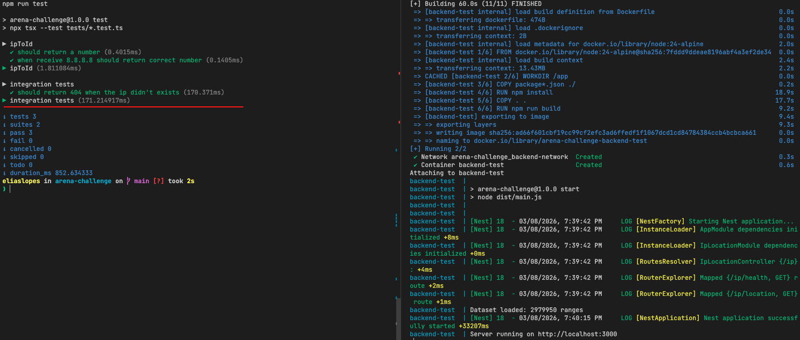
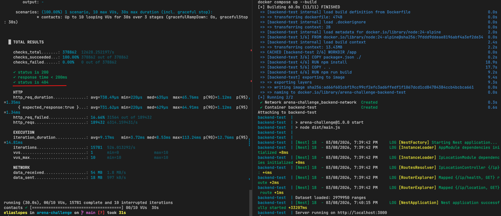

# IP Location API

---

# Tecnologias Utilizadas

- Node.js
- NestJS
- TypeScript
- Docker
- Docker Compose
- k6 (teste de performance)

---

# Pré-requisitos

Para rodar o projeto é necessário ter instalado:

- Node.js
- Docker
- Docker Compose
- Make

Opcional para testes de performance:

- k6

---

# Como Executar a Aplicação

O projeto possui um **Makefile** para facilitar a execução.

### Subir a aplicação

```bash
make start-application
```

Esse comando executa:

```bash
docker compose up --build
```

---

### Parar a aplicação

```bash
make finish-application
```

Esse comando executa:

```bash
docker compose down
```

---

# Executar Testes

Para rodar os testes unitários:

```bash
make run-tests
```

Ou diretamente:

```bash
npm run test
```

---

# Testes de Performance

Para rodar os testes de carga utilizando **k6**:

```bash
make run-k6
```

Ou diretamente:

```bash
npm run test:performance
```

---

# Evidências de Execução

A pasta **images** contém capturas de tela demonstrando o funcionamento da aplicação.

## Consumo de Memória

A aplicação foi projetada para operar **abaixo do limite de 300MB**.

Imagem mostrando o consumo do container no Docker:



---

## Testes Unitários

Execução dos testes unitários da aplicação:



---

## Teste de Performance

Resultado do teste de carga utilizando **k6**:



---

# Endpoint da API

### Health Check

```
GET /ip/health
```

Resposta esperada:

```json
{
  "status": "ok"
}
```

---

### Consulta de IP

```
GET /ip/location?ip=8.8.8.8
```

Resposta exemplo:

```json
{
  "country": "United States",
  "city": "Mountain View"
}
```

---

# Observação sobre o Dataset

O dataset **IP2Location DB11** não está versionado no repositório pois excede o limite de arquivos do GitHub.

O arquivo deve ser disponibilizado localmente para execução da aplicação.